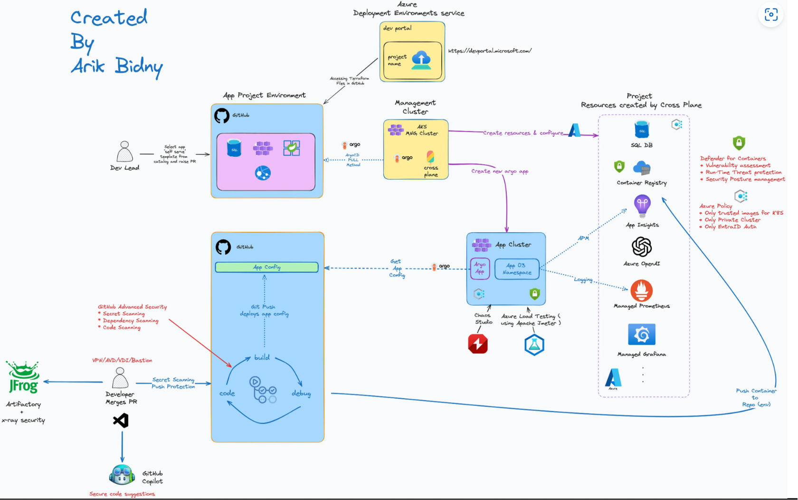

# Deploy and Configure ArgoCD and Deploy Crossplane with ArgoCD

```sh
az aks get-credentials --name <cluster-name> --resource-group <resource-group-name>
```
My management cluster:
```sh
az aks get-credentials --name orrocrspln-aks --resource-group env-orrocrspln-31-1737614754-rg
```

Install ArgoCD on the cluster:
```sh
kubectl apply -k argocd/install
```

### 1. Patch the argocd-server service to be of type LoadBalancer:

```sh
kubectl patch svc argocd-server -n argocd -p '{"spec": {"type": "LoadBalancer"}}'
```

### 2. Get the external IP of the argocd-server service:

```sh
kubectl get svc argocd-server -n argocd -o jsonpath='{.status.loadBalancer.ingress[0].ip}'
```

### 3. Retrieve the initial admin password:

```sh
kubectl -n argocd get secret argocd-initial-admin-secret -o jsonpath="{.data.password}" | base64 -d; echo
```

### 4. Login ArgoCD CLI into our argocd-server installed in AKS

```sh
argocd login $(kubectl get svc argocd-server -n argocd -o jsonpath='{.status.loadBalancer.ingress[0].ip}' ; echo) --username admin --password $(kubectl -n argocd get secret argocd-initial-admin-secret -o jsonpath="{.data.password}" | base64 -d; echo) --insecure
```

or

```sh
argocd login 172.188.212.150 --username admin --password $(kubectl -n argocd get secret argocd-initial-admin-secret -o jsonpath="{.data.password}" | base64 -d; echo) --insecure
```

### 5. Create a Secret for the Non-Standard Helm Chart Repository

This Helm chart needs to be picked up by Argo in a declarative GitOps way. But as this is a non-standard Helm Chart, we need to define a Secret first as the docs state: "Non standard Helm Chart repositories have to be registered explicitly. Each repository must have url, type and name fields."

```sh
kubectl apply -f argocd/crossplane-bootstrap/crossplane-helm-secret.yaml
```

### 6. Deploy the Crossplane Helm Chart

Now telling ArgoCD where to find our simple Crossplane Helm Chart, we use Argo's Application manifest in `argocd/crossplane-bootstrap/crossplane.yaml`:

```sh
kubectl apply -n argocd -f argocd/crossplane-bootstrap/crossplane.yaml
```
> **Note:**
> 
> This configuration sets up Crossplane core components to be automatically pruned by ArgoCD.
> 
> As the docs state [here](https://argo-cd.readthedocs.io/en/stable/operator-manual/declarative-setup/#crossplane-bootstrap), "Without the `resources-finalizer.argocd.argoproj.io finalizer`, deleting an application will not delete the resources it manages. To perform a cascading delete, you must add the finalizer. See App Deletion."
> 
> In other words, if we run `kubectl delete -n argocd -f argocd/crossplane-bootstrap/crossplane.yaml`, Crossplane wouldn't be undeployed as we may think. Only the ArgoCD Application would be deleted, but Crossplane Pods etc. would still be running.
> 
> Our Application configures Crossplane core components to be automatically pruned ([Automatic Pruning](https://argo-cd.readthedocs.io/en/stable/user-guide/auto_sync/#automatic-pruning)) via `automated: prune: true`.
> 
> We also use `syncOptions: - CreateNamespace=true` to let Argo create the `crossplane-system` namespace for us automatically.
>

### 7. Create Azure Credentials and Azure Provider Secret
https://docs.crossplane.io/latest/getting-started/provider-azure/#create-an-azure-service-principal

```sh
az ad sp create-for-rbac --sdk-auth --role Owner --scopes /subscriptions/<subscription-id> > azure-credentials.json
```

```sh
kubectl create secret generic azure-secret -n crossplane-system --from-file=creds=./azure-credentials.json
```

### 8. Install Crossplane's Azure Provider with ArgoCD

Our Crossplane Azure providers (Network, Compute, Storage, etc.) reside in `/upbound/provider-azure/provider`. How do we let ArgoCD manage and deploy this to our cluster? The simple way of defining a directory containing Kubernetes manifests is what we're looking for. Therefore, we create a new ArgoCD Application CRD at `/argocd/crossplane-bootstrap/crossplane-provider-azure.yaml` which tells ArgoCD to look in the directory path `/upbound/provider-azure/config`.
```sh
kubectl apply -f argocd/crossplane-bootstrap/crossplane-provider-azure.yaml
```
> **Note:**
> The crucial point here is to use the syncPolicy.automated flag as described in the docs: https://argo-cd.readthedocs.io/en/stable/user-guide/auto_sync/. Otherwise the deployment of the Crossplane `upbound-provider-family-azure` will throw an error.

The automated syncPolicy makes sure that child apps are automatically created, synced, and deleted when the manifest is changed.

This flag enables ArgoCD's "true" GitOps feature, where the CI/CD pipeline doesn't deploy themselfes (Push-based GitOps) but only makes a git commit. Then the GitOps operator inside the Kubernetes cluster (here ArgoCD) recognizes the change in the Git repository and deploys the changes to match the state of the repository in the cluster.

We also use the finalizer resources-finalizer.argocd.argoproj.io finalizer like we did with the Crossplane core components so that a `kubectl delete -f` would also undeploy all components of our Provider.

### 9. Install crossplane's Azure provider ProviderConfig with ArgoCD

To get our Provider finally working we also need to create a ProviderConfig accordingly that will tell the Provider where to find it's Azure credentials. 
To let ArgoCD manage and deploy our ProviderConfig we again create a new ArgoCD Application CRD at [argocd/crossplane-bootstrap/crossplane-provider-azure-config.yaml](https://github.com/orsharon7/sample-app/blob/main/argocd/crossplane-bootstrap/crossplane-provider-azure-config.yaml):

```sh
kubectl apply -f argocd/crossplane-bootstrap/crossplane-provider-azure-config.yaml
```

> **Note:**
> 1. Crossplane resources use the ProviderConfig named default if no specific ProviderConfig is specified, so this ProviderConfig will be the default for all Azure resources.
> 2. The secretRef.name and secretRef.key has to match the fields of the already created Secret.
>


##  Using ArgoCD's AppOfApps pattern to deploy Crossplane components
https://argo-cd.readthedocs.io/en/stable/operator-manual/cluster-bootstrapping/#app-of-apps-pattern

While our setup works now and also fully implements the GitOps way, we have a lot of Application files, that need to be applied in a specific order.

Our goal should be a single manifest defining the whole Crossplane setup incl. core, Provider, ProviderConfig etc. in ArgoCD.
Since deployment order wouldn't be clear and the Provider manifests need to be fully deployed before the ProviderConfig. Otherwise the deployment fails because of missing CRDs.

###  App of Apps Pattern vs. ApplicationSets

When managing multiple ArgoCD applications, you have several patterns to choose from. Two prominent options are the App of Apps Pattern and ApplicationSets, with the latter being integrated into the ArgoCD main project starting around version 2.6.

TL;DR:
- **App of Apps Pattern**
Ideal for cluster bootstrapping (e.g., installing tools like Crossplane), thanks to its SyncWaves support. This feature is highlighted in the ArgoCD cluster-bootstrapping documentation.
- **ApplicationSets**
Best for enabling teams to deploy applications in a GitOps model, especially when working with monorepos (e.g., backend, frontend, database). It simplifies workflows by automatically generating Application manifests through its powerful generators (e.g., Git Generator: Directories, Git Generator: Files).

In our case, we’re focusing on bootstrapping our cluster, which makes the App of Apps Pattern a natural fit.

```sh
kubectl apply -f argocd/crossplane-bootstrap.yaml
```


### Deploy Developer Environemnt
```sh
kubectl apply -f infrastructure/dev-environemnt.yaml
```